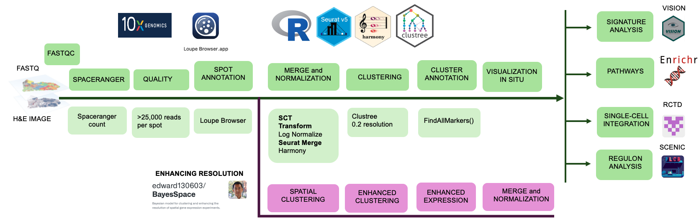

# Spatial Transcriptomic Analysis of Visium 10X Genomics data

This is the GitHub repository associated with my master's thesis _"Spatial characterization of the dynamic changes driven by an exon6 deletion variant in murine CTRB1"_ for the master in Bioinformatics and Computational Biology at the Autonomus University of Madrid.

## Table of Contents

1. [Installation](#introduction)
2. [Data availability](#installation)
3. [Pipeline](#usage)
4. [Scripts](#contributing)


## Installation

- Clone the repository
- Create conda environment with necessary dependencies. This can be done by cloning the following conda environments:

```bash
conda env create -f env_1.yml # For Seurat, Clustree, ggplot2
conda env create -f env_2.yml # For VISION, Harmony
conda env create -f env_3.yml # For SCENIC, spacexr, BayesSpace
```

### Package versions

For this analysis R version 4.3.3 and 4.3.2 were used. Package versions are stated in the thesis memory as well as in .yml files.


## Data availability

Data used for this project was generated in the Epithelial Carcinogenesis group at the CNIO. 
These were Visium 10X Genomics Spatial Transcriptomics data generated with pancreatic samples of a GEMM.
Data is not publicly available in this repository.

## Pipeline

The following figure illustrates the pipeline and makes easier the understanding of script organization:


## Scripts

### 1. Quality control

For quality control of the files <code>FASTQC</code> tool was used with the following command:

```bash
fastqc ./data/*.fastq.gz -o quality/ 
```

### 2. <code>Spaceranger</code> software

Spaceranger software was run on each capture area as stated on the file:

```bash
./1_spaceranger.sh
```

### 3. Downstream analysis with <code>R</code>

The downstream analysis consists of many steps, and some of them correspond to complementary tools used for comparing results.

  - **Create Seurat objects and add metadata from mannualy annotated CSVs**
    
```{R}
2_add_metadata.R
```

  - **Merge and clustering (<code>Seurat</code>, <code>Harmony</code>)**
    
```{R}
3_merge.R # Merge as part of the complete pipeline
harmony.R # Harmony trial for data integration
```

  - **Signature analysis  (<code>VISION</code>) and create figures**
    
Vision software was run for several signature scores of the ST data. These were plotted on top of the slides and violinplots were made with the next code:

```{R}
4_vision.R
5_vision_figures.R
```

  - **Single-cell integration (<code>RCTD</code> and <code>Seurat FindAnchors</code>)**
    
Single-cell integration was done with RCTD (spot deconvolution) and Seurat FindAnchors() for comparison:

```{R}
6_1_singlecell_integration.R
6_2_RCTD.R
```
RCTD results were joined and added to the metadata of the spatial object. The following code also constructs the barplots.

```{R}
6_3_RCTD_join.R 
```

  - **Correlations and DE analysis**

A function to compute correlation plots between two signatures or features was developed:

```{R}
correlations.R
```      
To compute signature-high vs signature-low spot DE analysis, following code was used:

```{R}
comparison.R
```

With results from this experiment, genes were uploaded to EnrichR, plots were done with following code:

```{R}
EnrichR_plot.R
```     

  - **Spot deconvolution ( <code>BayesSpace</code>)**

Spot deconvolution and subspot enhancment was done with BayesSpace software: 

```{R}
enhancing_BayesSpace.R
```  
  - **Regulon Analysis (<code>SCENIC</code>)**

```{R}
scenic.R
```
  - **Other helper functions are also added in this repository, some of them called from other scripts**
    
```{R}
convert_gmt_files.R # Converts human gene signatures (.gmt) into mouse ortholog
norm_and_clustering.R # Does SCT transform, umap reduction and clustering (with clustree comparison)
```


